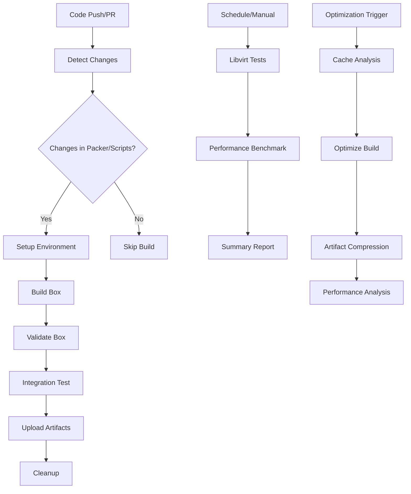

# CI/CD Pipeline Documentation

## Overview

This document describes the automated CI/CD pipeline for building, testing, and validating Vagrant boxes with libvirt/KVM support. The pipeline consists of three main workflows:

1. **Vagrant Box Build** - Main build and validation pipeline
2. **Vagrant Libvirt Test** - Comprehensive testing suite
3. **Box Optimization** - Performance and caching optimization

## Workflow Architecture



## Workflow Details

### 1. Vagrant Box Build (`vagrant-box-build.yml`)

**Purpose:** Build and validate Vagrant boxes for Ubuntu 24.04 with libvirt provider

**Triggers:**
- Push to main/develop branches (with relevant file changes)
- Pull requests to main branch
- Release creation
- Manual workflow dispatch

**Key Features:**
- Intelligent change detection
- Parallel job execution
- Comprehensive caching strategy
- Multi-scenario validation testing
- Artifact management for releases
- Performance optimization

**Jobs:**
1. **detect-changes** - Analyzes file changes to determine if build is needed
2. **setup-environment** - Installs KVM, libvirt, Packer, and Vagrant
3. **build-box** - Builds Vagrant box using Packer with caching
4. **validate-box** - Runs validation tests in parallel scenarios
5. **integration-test** - Comprehensive integration testing
6. **upload-artifacts** - Uploads artifacts for releases
7. **cleanup** - Cleans up resources and reports metrics

**Build Matrix:**
- `basic-up-down` - Basic VM lifecycle testing
- `provisioning-test` - Script provisioning validation
- `performance-test` - KVM optimization and performance
- `development-tools` - Development toolchain testing

### 2. Vagrant Libvirt Test (`vagrant-libvirt-test.yml`)

**Purpose:** Comprehensive testing of Vagrant libvirt provider functionality

**Triggers:**
- Daily scheduled runs (2 AM UTC)
- Push/PR with relevant changes
- Manual dispatch with configurable test levels

**Test Levels:**
- `smoke` - Basic connectivity only
- `standard` - Connectivity, provisioning, development tools
- `comprehensive` - All tests including performance, networking, security

**Key Features:**
- Environment compatibility checking
- Configurable test matrices
- Performance benchmarking
- Multiple box source support (local, Vagrant Cloud, custom URL)
- Comprehensive reporting

**Test Categories:**
1. **basic-connectivity** - VM startup and SSH connectivity
2. **provisioning** - Shell script provisioning capabilities
3. **development-tools** - Development environment validation
4. **performance** - KVM acceleration and performance metrics
5. **networking** - Network configuration and connectivity
6. **security** - Security configuration validation

### 3. Box Optimization (`box-optimization.yml`)

**Purpose:** Performance optimization and intelligent caching

**Triggers:**
- Workflow call from other pipelines
- Manual dispatch for specific optimization actions
- Scheduled optimization runs

**Optimization Actions:**
- `optimize-build` - Build process optimization
- `clear-cache` - Cache cleanup and invalidation
- `analyze-performance` - Performance pattern analysis
- `compress-artifacts` - Artifact compression testing

**Key Features:**
- Intelligent cache strategy selection
- Parallel optimization processing
- Compression algorithm testing
- Performance metrics collection
- Cache efficiency analysis

## Environment Requirements

### GitHub Runner Requirements

**Minimum:**
- Ubuntu latest runner
- 2 CPU cores, 8GB RAM
- 20GB available disk space
- KVM support (nested virtualization)

**Recommended:**
- 4 CPU cores, 16GB RAM
- 50GB available disk space
- SSD storage for better I/O performance

### Software Dependencies

**Automatically Installed:**
- QEMU/KVM and libvirt
- Packer (1.10.0)
- Vagrant (2.4.1) with vagrant-libvirt plugin
- Development tools (git, curl, etc.)

**Optional Tools:**
- Docker (for containerized testing)
- Performance monitoring tools
- Compression utilities (pigz, zstd, lz4)

## Configuration

### Environment Variables

```yaml
env:
  PACKER_VERSION: '1.10.0'
  VAGRANT_VERSION: '2.4.1'
  BOX_NAME: 'dev-box-ubuntu2404-libvirt'
  CACHE_KEY_PREFIX: 'vagrant-box-build'
  LIBVIRT_DEFAULT_URI: 'qemu:///system'
  TEST_TIMEOUT: '30m'
```

### Workflow Inputs

**Vagrant Box Build:**
- `box_version` - Version tag for the box
- `skip_validation` - Skip validation steps
- `upload_artifacts` - Upload build artifacts

**Vagrant Libvirt Test:**
- `test_level` - Test comprehensiveness level
- `box_source` - Source for test box
- `custom_box_url` - Custom box URL

**Box Optimization:**
- `action` - Optimization action to perform
- `cache_strategy` - Caching strategy
- `optimization_level` - Optimization intensity

## Caching Strategy

### Cache Types

1. **Build Cache**
   - Packer downloads and intermediate files
   - Content-based cache keys using file hashes
   - Fallback key hierarchy for partial matches

2. **Environment Cache**
   - Installed tools and dependencies
   - Runner-specific optimizations
   - Cross-workflow cache sharing

3. **Artifact Cache**
   - Built box files and checksums
   - Validation results
   - Performance metrics

### Cache Key Generation

```bash
# Primary cache key (exact match)
CACHE_KEY="v2-box-${PACKER_HASH}-${SCRIPTS_HASH}-${SYSTEM_HASH}"

# Fallback keys (partial matches)
FALLBACK1="v2-box-${PACKER_HASH}-${SCRIPTS_HASH}"
FALLBACK2="v2-box-${PACKER_HASH}"
FALLBACK3="v2-box"
```

## Artifact Management

### Artifact Types

1. **Box Files** (`.box`)
   - Built Vagrant boxes
   - SHA256 checksums
   - Metadata JSON files

2. **Reports**
   - Build logs
   - Validation reports
   - Performance metrics
   - Test summaries

3. **Optimization Data**
   - Cache analysis reports
   - Performance benchmarks
   - Compression test results

### Retention Policies

- **Box artifacts:** 30 days
- **Build logs:** 7 days
- **Test reports:** 7 days
- **Performance data:** 30 days
- **Release artifacts:** Permanent (attached to releases)

## Performance Optimization

### Build Performance

**Typical Timings:**
- Full build (cache miss): 25-35 minutes
- Cached build (cache hit): 8-12 minutes
- Validation suite: 15-20 minutes
- Integration tests: 10-15 minutes

**Optimization Features:**
- Parallel job execution
- Intelligent caching with content-based keys
- Conditional build execution
- Optimized VM resource allocation
- Artifact compression testing

### Cache Performance

**Hit Rate Targets:**
- Development builds: 70-80%
- Release builds: 50-60% (due to thorough validation)
- Scheduled tests: 80-90%

**Cache Efficiency:**
- Primary cache: Exact configuration match
- Fallback cache: Partial configuration match
- Emergency fallback: Base system cache

## Monitoring and Alerting

### Performance Metrics

- Build duration tracking
- Cache hit rate monitoring
- Test success rate analysis
- Resource utilization metrics

### Failure Handling

1. **Automatic Retries**
   - Network timeouts: 3 retries
   - VM startup failures: 2 retries
   - Cache misses: Fallback strategies

2. **Graceful Degradation**
   - Skip non-critical tests on timeout
   - Use fallback boxes for testing
   - Continue with partial validation

3. **Error Reporting**
   - Detailed logs in artifacts
   - Summary reports in workflow output
   - Performance impact analysis

## Security Considerations

### Build Security

- No hardcoded secrets in workflows
- Secure handling of GitHub tokens
- Isolated VM environments for testing
- Resource cleanup after builds

### Access Control

- Workflow triggers limited to authorized events
- Artifact access controlled by repository permissions
- Cache isolation between branches
- Secret management through GitHub Secrets

## Troubleshooting

See [Troubleshooting Guide](./troubleshooting-ci-cd.md) for detailed problem resolution steps.

## Maintenance

### Regular Tasks

1. **Weekly:**
   - Review cache hit rates
   - Monitor build performance trends
   - Check for workflow failures

2. **Monthly:**
   - Update base images and dependencies
   - Review and optimize cache strategies
   - Analyze performance metrics

3. **Quarterly:**
   - Evaluate and update workflow configurations
   - Review security settings
   - Update documentation

### Version Updates

**Packer Updates:**
```yaml
# Update in workflow file
env:
  PACKER_VERSION: 'x.x.x'  # New version
```

**Vagrant Updates:**
```yaml
# Update in workflow file
env:
  VAGRANT_VERSION: 'x.x.x'  # New version
```

## Integration with Development Workflow

### Pull Request Integration

- Automatic builds on PR creation
- Validation results in PR comments
- Cache optimization for development speed
- Parallel testing for quick feedback

### Release Integration

- Automatic artifact creation on releases
- Comprehensive validation before publication
- Performance regression testing
- Artifact signing and verification

### Development Environment

- Local testing instructions
- Cache warming strategies
- Performance profiling tools
- Debug mode configurations

## Cost Optimization

### Resource Usage

- Efficient runner utilization
- Intelligent job scheduling
- Cache-first strategies
- Conditional execution

### GitHub Actions Minutes

- Optimized for public repositories
- Cache usage to reduce build times
- Parallel execution within limits
- Strategic use of self-hosted runners (future)

## Future Enhancements

### Planned Features

1. **Advanced Caching**
   - Distributed cache sharing
   - Predictive cache warming
   - ML-based optimization

2. **Enhanced Testing**
   - Cross-platform validation
   - Performance regression detection
   - Automated security scanning

3. **Monitoring Integration**
   - Real-time performance dashboards
   - Alerting for performance degradation
   - Trend analysis and prediction

4. **Developer Experience**
   - Local development optimization
   - IDE integration
   - Automated troubleshooting

## References

- [GitHub Actions Documentation](https://docs.github.com/en/actions)
- [Packer Documentation](https://www.packer.io/docs)
- [Vagrant Documentation](https://www.vagrantup.com/docs)
- [Libvirt Documentation](https://libvirt.org/docs.html)