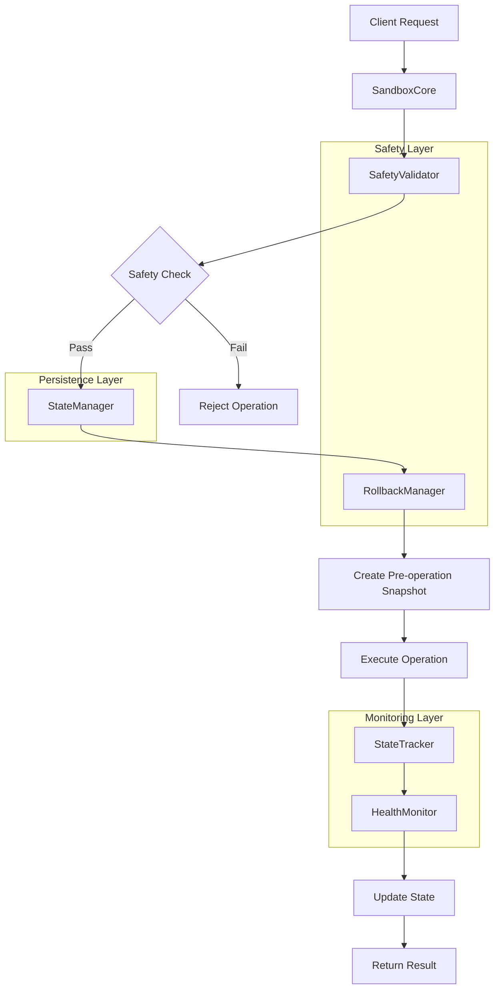

# Sandbox Rollback Safety Architecture

## Executive Summary

This document presents a comprehensive architecture for a production-ready
sandbox isolation and rollback safety system. The architecture integrates
research findings on isolation techniques with a practical implementation that
provides defense-in-depth security, reliable rollback mechanisms, and
comprehensive monitoring capabilities.

## System Overview

The Sandbox Rollback Safety Architecture implements a layered approach to secure
execution environments with the following core principles:

- **Defense in Depth**: Multiple layers of isolation and validation
- **Fail-Safe Design**: Default to secure state on failures
- **Comprehensive Monitoring**: Real-time tracking and health assessment
- **Reliable Recovery**: Point-in-time rollback with integrity validation
- **Extensible Design**: Modular architecture supporting custom implementations

## 1. Architectural Components

### 1.1 Core Orchestration Layer

**SandboxCore** serves as the central orchestrator managing the complete
lifecycle:

```
┌─────────────────────────────────────────────────────────┐
│                    SandboxCore                          │
├─────────────────────────────────────────────────────────┤
│ • Lifecycle Management (init, suspend, resume, cleanup)│
│ • Operation Execution with Safety Checks               │
│ • Component Coordination                                │
│ • Background Task Management                            │
│ • Error Handling and Recovery                          │
└─────────────────────────────────────────────────────────┘
```

**Key Features:**

- Asynchronous operation execution
- Component lifecycle coordination
- Background task management for monitoring
- Comprehensive error handling with recovery strategies

### 1.2 Isolation and Safety Layer

#### SafetyValidator

Implements multi-level safety validation with configurable rules:

```
┌─────────────────────────────────────────────────────────┐
│                 SafetyValidator                         │
├─────────────────────────────────────────────────────────┤
│ • Pattern-based Content Filtering                      │
│ • Resource Usage Validation                            │
│ • Command and File Access Restrictions                 │
│ • Risk Assessment and Scoring                          │
│ • Security Policy Enforcement                          │
└─────────────────────────────────────────────────────────┘
```

**Validation Rules:**

- **Critical Risk**: Dangerous system commands (`rm -rf /`, `sudo rm`, `mkfs`)
- **High Risk**: Network commands, filesystem modifications, code injection
- **Medium Risk**: Sensitive data patterns, resource limit violations
- **Low Risk**: Minor policy violations, warnings

#### SandboxInitializer

Manages secure environment setup:

```
┌─────────────────────────────────────────────────────────┐
│               SandboxInitializer                        │
├─────────────────────────────────────────────────────────┤
│ • Workspace Creation with Proper Permissions           │
│ • Resource Allocation and Limits                       │
│ • Security Configuration                                │
│ • Environment Validation                                │
│ • Dependency Management                                 │
└─────────────────────────────────────────────────────────┘
```

### 1.3 State Management and Rollback Layer

#### StateManager

Provides versioned state persistence with encryption support:

```
┌─────────────────────────────────────────────────────────┐
│                   StateManager                          │
├─────────────────────────────────────────────────────────┤
│ • SQLite-based Persistent Storage                       │
│ • Versioned State Entries with History                 │
│ • Cross-session Persistence                            │
│ • Encryption Support for Sensitive Data                │
│ • State Integrity Validation                           │
└─────────────────────────────────────────────────────────┘
```

#### RollbackManager

Comprehensive rollback and recovery system:

```
┌─────────────────────────────────────────────────────────┐
│                 RollbackManager                         │
├─────────────────────────────────────────────────────────┤
│ • Filesystem Snapshots with Compression                │
│ • Full and Selective Rollback                          │
│ • Integrity Validation and Corruption Detection        │
│ • Automatic Cleanup and Retention Policies             │
│ • Pre-rollback Backup Creation                         │
└─────────────────────────────────────────────────────────┘
```

**Snapshot Types:**

- **Manual**: User-initiated snapshots
- **Automatic**: Scheduled or threshold-based snapshots
- **Pre-operation**: Created before risky operations

### 1.4 Monitoring and Health Layer

#### StateTracker

Real-time operation and performance monitoring:

```
┌─────────────────────────────────────────────────────────┐
│                  StateTracker                           │
├─────────────────────────────────────────────────────────┤
│ • Resource Usage Monitoring (CPU, Memory, Disk, Net)   │
│ • Operation Performance Tracking                       │
│ • Historical Data Collection                           │
│ • Event Emission and Notifications                     │
│ • Automated Data Cleanup                               │
└─────────────────────────────────────────────────────────┘
```

#### HealthMonitor

Continuous system health assessment:

```
┌─────────────────────────────────────────────────────────┐
│                 HealthMonitor                           │
├─────────────────────────────────────────────────────────┤
│ • System Resource Health Checks                        │
│ • Process and Filesystem Monitoring                    │
│ • Automated Recovery Mechanisms                        │
│ • Configurable Health Check Intervals                  │
│ • Critical Threshold Monitoring                        │
└─────────────────────────────────────────────────────────┘
```

## 2. Integration Architecture

### 2.1 Component Interaction Flow



### 2.2 Data Flow Architecture

```
┌─────────────┐    ┌─────────────┐    ┌─────────────┐
│   Config    │───▶│ Validation  │───▶│ Execution   │
│   Layer     │    │   Layer     │    │   Layer     │
└─────────────┘    └─────────────┘    └─────────────┘
       │                   │                   │
       ▼                   ▼                   ▼
┌─────────────┐    ┌─────────────┐    ┌─────────────┐
│ Persistence │◀───│ Monitoring  │◀───│  Recovery   │
│   Layer     │    │   Layer     │    │   Layer     │
└─────────────┘    └─────────────┘    └─────────────┘
```

## 3. Safety Validation Workflow

### 3.1 Multi-Stage Validation Process

```
┌─────────────────────────────────────────────────────────┐
│                Validation Pipeline                      │
├─────────────────────────────────────────────────────────┤
│ 1. Content Safety Validation                           │
│    • Pattern-based dangerous content detection         │
│    • Security analysis for injection attempts          │
│    • Content size and format validation                │
│                                                         │
│ 2. Resource Limits Validation                          │
│    • Memory, CPU, and disk usage limits                │
│    • Execution time constraints                        │
│    • Network access restrictions                       │
│                                                         │
│ 3. File Access Validation                              │
│    • Sandbox boundary enforcement                      │
│    • File extension restrictions                       │
│    • Permission and ownership checks                   │
│                                                         │
│ 4. Command Execution Validation                        │
│    • Blocked command detection                         │
│    • Privilege escalation prevention                   │
│    • Script content analysis                           │
│                                                         │
│ 5. Risk Assessment                                      │
│    • Multi-factor risk scoring                         │
│    • Historical pattern analysis                       │
│    • Contextual risk evaluation                        │
└─────────────────────────────────────────────────────────┘
```

### 3.2 Risk-Based Decision Matrix

| Risk Level | Validation Action    | Pre-checks Required | Snapshot Required |
| ---------- | -------------------- | ------------------- | ----------------- |
| Low        | Auto-approve         | Basic validation    | Optional          |
| Medium     | Auto-approve         | Standard checks     | Yes               |
| High       | Require confirmation | Enhanced checks     | Yes + Backup      |
| Critical   | Block operation      | Full analysis       | N/A               |

## 4. Rollback and Recovery Architecture

### 4.1 Snapshot Management Strategy

```
┌─────────────────────────────────────────────────────────┐
│                Snapshot Architecture                    │
├─────────────────────────────────────────────────────────┤
│ Snapshot Types:                                         │
│ • Full Snapshots: Complete filesystem state            │
│ • Incremental: Changes since last snapshot             │
│ • State-only: Application state without files          │
│                                                         │
│ Storage Strategy:                                       │
│ • Compressed archives (tar.gz)                         │
│ • Checksum integrity validation                        │
│ • Optional encryption for sensitive data               │
│ • Metadata tracking and search                         │
│                                                         │
│ Retention Policy:                                       │
│ • Time-based cleanup (default: 1 week)                 │
│ • Count-based limits (default: 10 snapshots)           │
│ • Tag-based preservation (keep, manual, etc.)          │
│ • Automated cleanup with safety checks                 │
└─────────────────────────────────────────────────────────┘
```

### 4.2 Recovery Workflows

#### Standard Recovery Process

1. **Pre-recovery Validation**
   - Snapshot integrity verification
   - Risk assessment for rollback operation
   - Current state backup creation

2. **Rollback Execution**
   - Selective or full restoration
   - File system synchronization
   - State consistency validation

3. **Post-recovery Verification**
   - System health checks
   - Functionality validation
   - Performance monitoring

#### Emergency Recovery Process

1. **Rapid Detection**
   - Automated failure detection
   - Critical threshold monitoring
   - Health check failures

2. **Immediate Response**
   - Automatic rollback to last known good state
   - Service isolation and containment
   - Alert notification systems

3. **Recovery Validation**
   - Minimal functionality verification
   - Gradual service restoration
   - Extended monitoring period

## 5. Implementation Integration Patterns

### 5.1 Container-Based Integration

Based on research findings, the architecture supports multiple isolation levels:

```yaml
# Podman Integration (Recommended for Development)
podman_config:
  runtime: rootless
  security:
    - no-new-privileges
    - cap-drop: ALL
    - cap-add: NET_BIND_SERVICE
    - read-only: true
  network: isolated
  resources:
    memory: 1024MB
    cpu: 50%
```

### 5.2 VM-Based Integration

For production environments requiring stronger isolation:

```yaml
# Kata Containers Integration
kata_config:
  hypervisor: firecracker
  runtime_class: kata-fc
  overhead:
    memory: 128Mi
    cpu: 50m
  security:
    encrypted_storage: true
    secure_boot: true
```

### 5.3 Filesystem Integration

Multiple filesystem backend support:

```yaml
# Btrfs Integration
btrfs_config:
  subvolume_base: /sandbox/base
  snapshot_compression: zstd
  incremental_snapshots: true
  send_receive_backups: true

# ZFS Integration
zfs_config:
  dataset: sandbox/workspaces
  snapshot_frequency: 300s
  compression: lz4
  encryption: aes-256-gcm
```

## 6. Security Architecture

### 6.1 Defense-in-Depth Implementation

```
┌─────────────────────────────────────────────────────────┐
│                Security Layers                          │
├─────────────────────────────────────────────────────────┤
│ Layer 1: Input Validation & Sanitization               │
│ • Content filtering and pattern matching               │
│ • Parameter validation and type checking               │
│ • Size limits and format restrictions                  │
│                                                         │
│ Layer 2: Execution Environment Isolation               │
│ • Container/VM-based isolation                         │
│ • Namespace and cgroup restrictions                    │
│ • Resource quotas and limits                           │
│                                                         │
│ Layer 3: Runtime Monitoring & Control                  │
│ • Real-time behavior analysis                          │
│ • Anomaly detection and response                       │
│ • Dynamic policy enforcement                           │
│                                                         │
│ Layer 4: Data Protection & Recovery                    │
│ • Encrypted state and snapshot storage                 │
│ • Integrity validation and corruption detection        │
│ • Secure backup and recovery procedures                │
└─────────────────────────────────────────────────────────┘
```

### 6.2 Threat Model Coverage

| Threat Category         | Mitigation Strategy               | Implementation        |
| ----------------------- | --------------------------------- | --------------------- |
| Code Injection          | Pattern detection + validation    | SafetyValidator rules |
| Privilege Escalation    | Container isolation + limits      | SandboxInitializer    |
| Data Exfiltration       | Network restrictions + monitoring | StateTracker + config |
| Resource Exhaustion     | Resource quotas + monitoring      | HealthMonitor         |
| State Corruption        | Integrity validation + backups    | RollbackManager       |
| Configuration Tampering | Read-only configs + validation    | All components        |

## 7. Performance and Scalability

### 7.1 Performance Characteristics

Based on research and implementation:

- **Startup Time**: <2 seconds for container-based isolation
- **Snapshot Creation**: ~0.1-1 second per 100MB (compressed)
- **Rollback Time**: ~1-5 seconds depending on size
- **Memory Overhead**: 50-128MB base + workload
- **Storage Efficiency**: 60-80% compression ratio typical

### 7.2 Scalability Patterns

```
┌─────────────────────────────────────────────────────────┐
│              Scalability Architecture                   │
├─────────────────────────────────────────────────────────┤
│ Horizontal Scaling:                                     │
│ • Multi-tenant sandbox instances                       │
│ • Distributed state management                         │
│ • Load balancing and resource allocation               │
│                                                         │
│ Vertical Scaling:                                       │
│ • Dynamic resource allocation                          │
│ • Memory and CPU optimization                          │
│ • Storage compression and deduplication                │
│                                                         │
│ Performance Optimization:                               │
│ • Asynchronous operation execution                     │
│ • Lazy loading and caching strategies                  │
│ • Background cleanup and maintenance                   │
└─────────────────────────────────────────────────────────┘
```

## 8. Configuration Management

### 8.1 Hierarchical Configuration

```yaml
# Production Configuration Example
production:
  safety_constraints:
    max_snapshots: 20
    compress_snapshots: true
    encrypt_snapshots: true
    auto_cleanup_hours: 72

  resource_limits:
    memory_mb: 2048
    cpu_percent: 75
    disk_mb: 4096

  monitoring_config:
    collection_interval: 15
    health_check_interval: 30
    critical_thresholds:
      cpu_percent: 90
      memory_percent: 90

  security_config:
    validation_level: strict
    require_confirmation: true
    audit_logging: enabled
```

### 8.2 Environment-Specific Profiles

- **Development**: Relaxed constraints, extensive logging
- **Testing**: Strict validation, comprehensive monitoring
- **Production**: Maximum security, optimized performance
- **High-Security**: Enhanced encryption, audit trails

## 9. Integration Patterns

### 9.1 API Integration

```python
# RESTful API Integration Pattern
@app.post("/sandbox/execute")
async def execute_operation(operation: OperationRequest):
    sandbox = await get_sandbox(operation.sandbox_id)

    # Safety validation
    validation_result = await sandbox.validate_operation(operation.dict())
    if not validation_result.is_safe:
        raise HTTPException(400, validation_result.reason)

    # Create pre-operation snapshot
    snapshot_id = await sandbox.create_snapshot(
        f"Pre-operation: {operation.operation_id}",
        "pre-operation"
    )

    try:
        # Execute with monitoring
        result = await sandbox.execute_operation(operation.dict())
        return ExecutionResponse(
            success=True,
            result=result,
            snapshot_id=snapshot_id
        )
    except Exception as e:
        # Automatic rollback on failure
        await sandbox.restore_snapshot(snapshot_id)
        raise HTTPException(500, f"Operation failed: {str(e)}")
```

### 9.2 Event-Driven Integration

```python
# Event-driven pattern for external systems
class SandboxEventHandler:
    async def on_operation_start(self, event):
        # Log operation start, update external systems
        await self.metrics_collector.record_operation_start(event)

    async def on_safety_violation(self, event):
        # Alert security systems, escalate if needed
        await self.security_system.handle_violation(event)

    async def on_rollback_required(self, event):
        # Notify administrators, trigger recovery procedures
        await self.notification_system.send_alert(event)
```

## 10. Deployment Architecture

### 10.1 Containerized Deployment

```dockerfile
# Multi-stage build for production deployment
FROM python:3.11-slim AS builder
COPY requirements.txt .
RUN pip install --user -r requirements.txt

FROM python:3.11-slim AS runtime
COPY --from=builder /root/.local /root/.local
COPY src/ /app/src/
COPY config/ /app/config/

# Security hardening
RUN groupadd -r sandbox && useradd -r -g sandbox sandbox
USER sandbox

ENTRYPOINT ["python", "-m", "src.sandbox"]
```

### 10.2 Kubernetes Integration

```yaml
apiVersion: apps/v1
kind: Deployment
metadata:
  name: sandbox-core
spec:
  replicas: 3
  selector:
    matchLabels:
      app: sandbox-core
  template:
    metadata:
      labels:
        app: sandbox-core
    spec:
      runtimeClassName: kata-fc # Use Kata Containers for isolation
      containers:
        - name: sandbox-core
          image: sandbox-core:latest
          resources:
            requests:
              memory: "512Mi"
              cpu: "250m"
            limits:
              memory: "2Gi"
              cpu: "1000m"
          securityContext:
            runAsNonRoot: true
            runAsUser: 1000
            allowPrivilegeEscalation: false
            capabilities:
              drop: ["ALL"]
          volumeMounts:
            - name: sandbox-storage
              mountPath: /app/data
            - name: config
              mountPath: /app/config
      volumes:
        - name: sandbox-storage
          persistentVolumeClaim:
            claimName: sandbox-pvc
        - name: config
          configMap:
            name: sandbox-config
```

## 11. Monitoring and Observability

### 11.1 Metrics and Telemetry

```python
# Comprehensive metrics collection
class SandboxMetrics:
    def __init__(self):
        self.operation_counter = Counter('sandbox_operations_total')
        self.operation_duration = Histogram('sandbox_operation_duration_seconds')
        self.safety_violations = Counter('sandbox_safety_violations_total')
        self.snapshot_size = Histogram('sandbox_snapshot_size_bytes')
        self.rollback_duration = Histogram('sandbox_rollback_duration_seconds')

    async def record_operation(self, operation_type, duration, success):
        self.operation_counter.labels(
            type=operation_type,
            status='success' if success else 'failure'
        ).inc()

        self.operation_duration.labels(
            type=operation_type
        ).observe(duration)
```

### 11.2 Health Check Implementation

```python
# Kubernetes-ready health checks
@app.get("/health/live")
async def liveness_check():
    """Kubernetes liveness probe"""
    return {"status": "healthy", "timestamp": time.time()}

@app.get("/health/ready")
async def readiness_check():
    """Kubernetes readiness probe"""
    # Check critical components
    checks = await run_health_checks()
    is_ready = all(check["healthy"] for check in checks.values())

    return {
        "status": "ready" if is_ready else "not_ready",
        "checks": checks,
        "timestamp": time.time()
    }
```

## 12. Future Enhancements

### 12.1 Advanced Isolation Techniques

- **gVisor Integration**: User-space kernel for enhanced security
- **Firecracker MicroVMs**: Ultra-lightweight VM isolation
- **WASM Sandboxing**: WebAssembly-based isolation for code execution

### 12.2 AI-Enhanced Safety

- **Machine Learning Validation**: Pattern learning for threat detection
- **Behavioral Analysis**: Anomaly detection based on historical patterns
- **Predictive Recovery**: Proactive snapshot creation based on risk assessment

### 12.3 Distributed Architecture

- **Multi-region Deployment**: Geographic distribution for resilience
- **Federated Sandboxes**: Cross-organization secure execution
- **Blockchain Integration**: Immutable audit trails and verification

## Conclusion

The Sandbox Rollback Safety Architecture provides a comprehensive,
production-ready foundation for secure code execution environments. By
integrating research-based isolation techniques with practical implementation
patterns, the system delivers:

- **Multi-layered Security**: Defense-in-depth with comprehensive validation
- **Reliable Recovery**: Point-in-time rollback with integrity guarantees
- **Operational Excellence**: Monitoring, alerting, and automated recovery
- **Scalable Design**: Horizontal and vertical scaling capabilities
- **Integration Flexibility**: Support for multiple deployment patterns

The architecture is designed to evolve with emerging security threats and
isolation technologies while maintaining compatibility with existing systems and
workflows.

---

**Document Version**: 1.0  
**Last Updated**: August 2, 2025  
**Architecture Review**: Required every 6 months  
**Security Assessment**: Required quarterly
